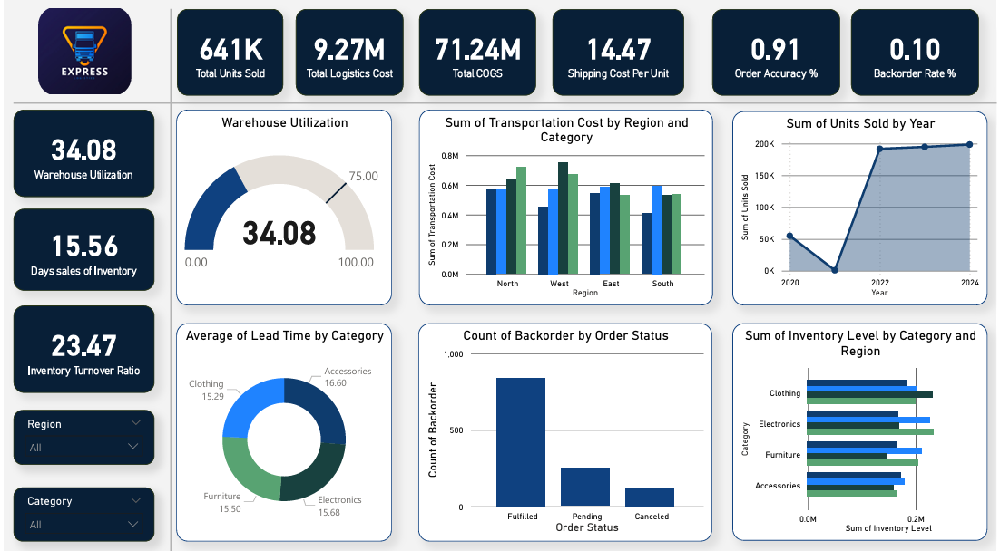

# Supply Chain & Inventory Performance Analytics

This repository provides a comprehensive end-to-end analysis of supply chain operations, focusing on inventory optimization, logistics efficiency, and supplier performance. The project utilizes Python for feature engineering, SQL for data extraction, and Power BI for executive-level dashboarding.

## 📊 Business KPIs Tracked
* **Inventory Turnover:** Measuring how efficiently inventory is sold and replaced.
* **Warehouse Utilization %:** Identifying overcapacity or underutilized storage space.
* **Backorder Risk:** Highlighting regions and categories prone to stockouts.
* **Shipping Cost per Unit:** Evaluating logistics efficiency by region and category.
* **Supplier Accuracy & Lead Time:** Rating suppliers based on reliability and speed.

## 🗂️ Project Structure
* `FE.ipynb`: Python notebook containing Feature Engineering and KPI calculations using Pandas and NumPy.
* `SQL_Queries/`: A collection of scripts for deep-dive analysis:
    * `BackorderRiskAnalysis.sql`: Identifies high-risk regions for stockouts.
    * `InventoryTurnover.sql`: Calculates financial efficiency metrics.
    * `Logistics&ShippingCostEfficiency.sql`: Analyzes transportation cost impact.
    * `WarehouseCapacity&Utilization.sql`: Monitors storage health.
    * `supplier_performance.sql`: Tracks vendor reliability metrics.
* `Inventory_SupplyChain_Dataset.csv`: The primary dataset containing 1,200 records of regional supply chain data.

## 🛠️ Technology Stack
* **Data Processing:** Python (Pandas, NumPy)
* **Database Querying:** SQL (T-SQL/Standard SQL)
* **Visualization:** Power BI, Matplotlib, Seaborn
* **Environment:** Jupyter Notebook

## 📈 Key Insights from Analysis
* **Stock Status Logic:** Inventory is automatically flagged into three categories: *Optimal*, *High Risk* (over 80% utilization), and *Critical Low* (under 20% utilization) to assist in proactive restocking.
* **Logistics Efficiency:** Detailed breakdown of shipping costs per unit sold, allowing for regional cost-optimization strategies.
* **Supplier Reliability:** Calculation of an "Accuracy Rate %" and "Average Lead Time" per supplier to aid in procurement decision-making.

## 🚀 How to Use
1.  **Data Prep:** Run `FE.ipynb` to generate the engineered features and KPIs.
2.  **Analysis:** Execute the SQL scripts against the processed dataset to generate summary tables.
3.  **Visualization:** Import the dataset into Power BI to view the interactive dashboard.

---
*Developed as a tool for Supply Chain Managers and Data Analysts to drive data-driven inventory decisions.*